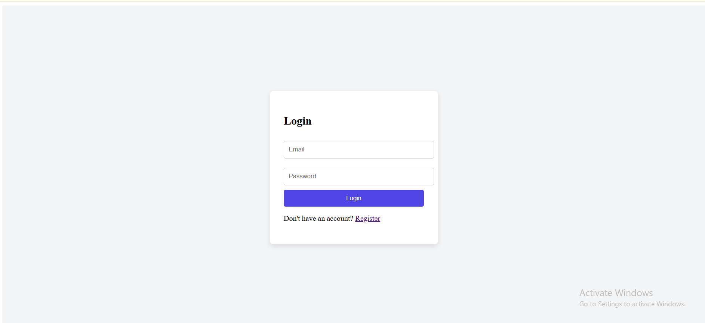
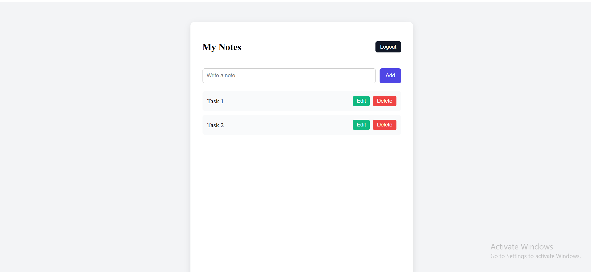

# 📝 Secure Notes App

A production-ready full-stack secure notes application built using React (Vite), Node.js, Express, Supabase, and JWT authentication.

Users can securely register, login, and manage personal notes with protected API routes.

---

## 🚀 Live Demo

🔗 **Frontend (Vercel)**
[https://secure-notes-frontend-lilac.vercel.app/](https://secure-notes-frontend-lilac.vercel.app/)

🔗 **Backend (Render API)**
[https://secure-notes-backend-xl56.onrender.com](https://secure-notes-backend-xl56.onrender.com)

---

## 💻 GitHub Repositories

👩‍💻 GitHub Profile:
[https://github.com/ARCHANA-MADDELA-57](https://github.com/ARCHANA-MADDELA-57)

Backend Repository:
[https://github.com/ARCHANA-MADDELA-57/secure-notes-backend](https://github.com/ARCHANA-MADDELA-57/secure-notes-backend)

Frontend Repository:
[https://github.com/ARCHANA-MADDELA-57/secure-notes-frontend](https://github.com/ARCHANA-MADDELA-57/secure-notes-frontend)

---

## 🛠 Tech Stack

### Frontend

* React (Vite)
* Axios
* Environment Variables (VITE_API_URL)
* JWT stored in LocalStorage

### Backend

* Node.js
* Express.js
* Supabase (PostgreSQL Database)
* JWT Authentication
* REST API Architecture
* CORS Configuration

---

## 🔐 Features

* User Registration
* Secure Login
* JWT-Based Authentication
* Protected Routes
* Create Notes
* Edit Notes
* Delete Notes
* Full CRUD Operations
* Responsive UI

---

## 🖼 Screenshots

> Add your screenshots inside a folder named `screenshots` in your frontend repository.

### 🔑 Login Page


### 🔑 Login Page



### 📝 Dashboard



---

## 📂 Project Structure

### Backend

```
backend/
 ├── server.js
 ├── routes/
 ├── middleware/
 ├── package.json
 ├── .gitignore
```

### Frontend

```
frontend/
 ├── src/
 ├── components/
 ├── pages/
 ├── package.json
 ├── vite.config.js
 ├── .gitignore
```

---

## ⚙️ Environment Variables

### Backend (.env)

```
SUPABASE_URL=your_supabase_url
SUPABASE_KEY=your_supabase_key
JWT_SECRET=your_jwt_secret
```

### Frontend (Vercel Environment Variables)

```
VITE_API_URL=https://secure-notes-backend-xl56.onrender.com
```

---

## 🧪 Running Locally

### 1️⃣ Clone Backend

```
git clone https://github.com/ARCHANA-MADDELA-57/secure-notes-backend.git
cd secure-notes-backend
npm install
npm start
```

### 2️⃣ Clone Frontend

```
git clone https://github.com/ARCHANA-MADDELA-57/secure-notes-frontend.git
cd secure-notes-frontend
npm install
npm run dev
```

---

## 🌍 Deployment Architecture

Frontend (Vercel)
↓
Backend API (Render)
↓
Supabase (PostgreSQL Database)

Authentication Flow:

1. User logs in or registers.
2. Backend validates credentials.
3. JWT token is generated.
4. Token stored in browser LocalStorage.
5. Protected routes verify token before serving data.

---

## 📈 Future Improvements

* Refresh Token Implementation
* Add Note Descriptions & Timestamps
* Dark Mode UI
* Loading States & Toast Notifications
* Pagination for Notes
* Role-Based Authorization

---

## 📄 License

This project is open-source and created for learning and portfolio purposes.
